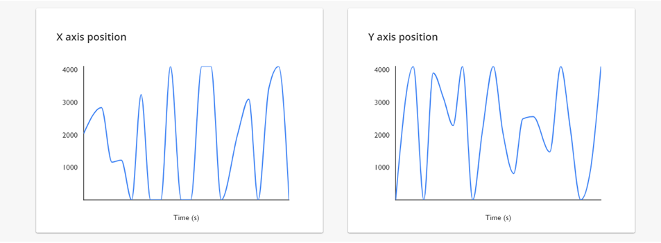

# AVR IoT WG Sensor Node using a ThumbStick Click

Devices: \| **ATmega4808(MCU)** \| **WINC1510(Wi-Fi®)** \| **ECC608(CryptoAuthLib)** \|

---
## Software Requirements
   + MPLAB X v5.20 or later
   + XC8 Compiler v2.10 or later
   + AVR GCC Toolchain v3.62 with GCC compiler v5.4.0 
   + Serial Terminal Application (optional)

## Hardware Requirements
   + AVR IoT WG Development board (https://www.microchip.com/DevelopmentTools/ProductDetails/AC164160)
   + ThumbStick Click (https://www.mikroe.com/thumbstick-click)
   + Computer
   + USB cable

## Steps
  1. Plug-in the ThumbStick click on the AVR-IoT/PIC-IoT WG Development Boards. The label ‘ThumbStick click’ should ideally be on the side of the 2 pushbuttons (the pushbuttons are labeled SW1 and SW2) and the ATWINC1510 Wi-Fi® element (white colored chip) on the board.
  2. Connect board to PC using USB-micro cable. 
  3. Connect the board to a Wi-Fi network following the steps outline here: https://github.com/microchip-pic-avr-solutions/avr-iot-google-sensor-node-mplab/blob/master/README.md#operation
  4. Observe the data sent by the AVR IoT WG development board on the https://avr-iot.com/ page. 
  
  5. The position data transmitted by the ThumbStick click will be shown on the webpage with 2 graphs mapping the x-axis and y-axis positions of the click.
    
  6. Verify that the data from on-board ThumbStick click is being transmitted successfully to the Google Cloud by changing the position of the ThumbStick and observing the graphs.

## Information
   1. The application publishes data on the ``/devices/deviceID/events `` topic to the Google Cloud
   2. The following payload is sent in JSON format:
      * payload:  
     ``{"Light":lightValue,"Temp":temperatureValue, "X axis position":xaxisposition, "Y axis position":yaxisposition} ``
  3. The C code for sending MQTT publish packets is available in AVRIoT.X/mcc_generated_files/main.c file.
     + The API ``static void sendToCloud(void)`` is responsible for publishing data at an interval of 1 second. 
  4. The yellow LED on the board is toggled every time a MQTT publish packet is sent successfully to the CLoud.
  5. Command line interface of the firmware can be accessed using any serial terminal application like TeraTerm or Putty. For more information refer to: https://github.com/microchip-pic-avr-solutions/avr-iot-google-sensor-node-mplab/blob/master/README.md#command-line-interface.

---